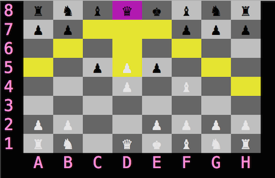

## Ruby Chess

Chess on the command line.  

- **Chess.rb**: Initializes game and handles turn toggling.
- **Board.rb**: Sets up the board, checks for mate/checkmate, handles pawn promotion and castling.
- **Cursor.rb**:  Handles keyboard input.
- **Player.rb**: Prompts and handles player inputs.
- **Piece** classes with common movement types use **Steppable** and **Slidable** modules to find valid moves. The individual pieces define which directions they can move in; the modules abstract away everything else.
- **EmptySquare** represents empty positions on the board - the [null object pattern](https://en.wikipedia.org/wiki/Null_Object_pattern) is particularly useful when
representing game boards as 2d arrays!  

### How to play
Download the zip and run **ruby chess.rb** from the root.
